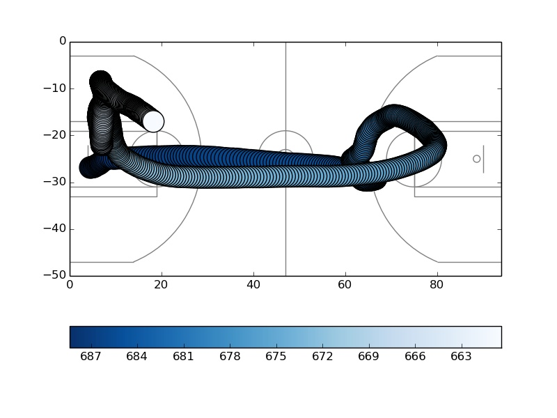
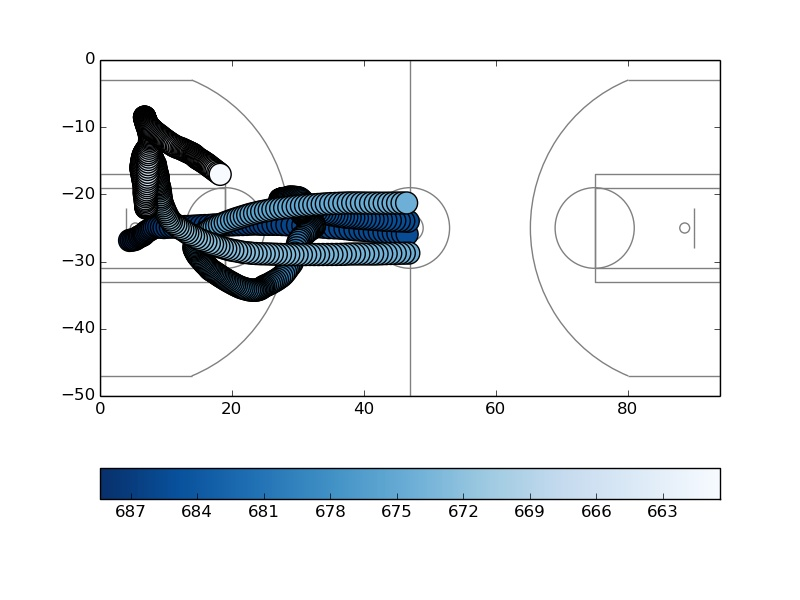
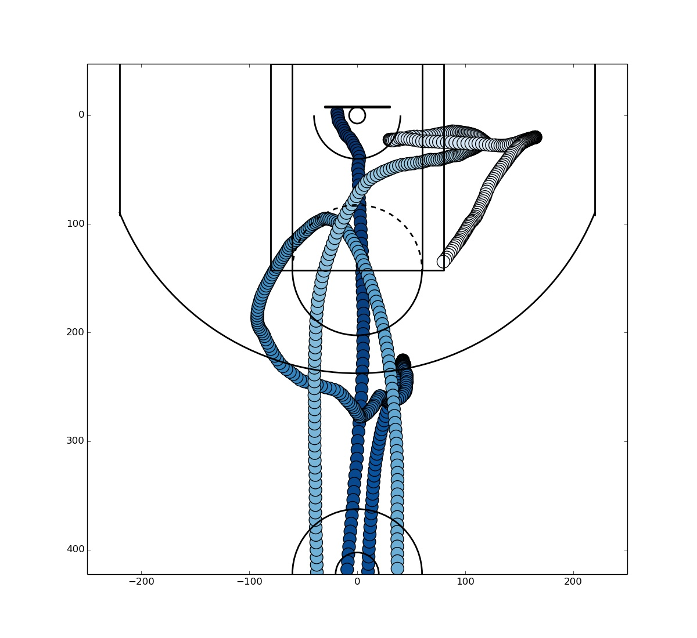
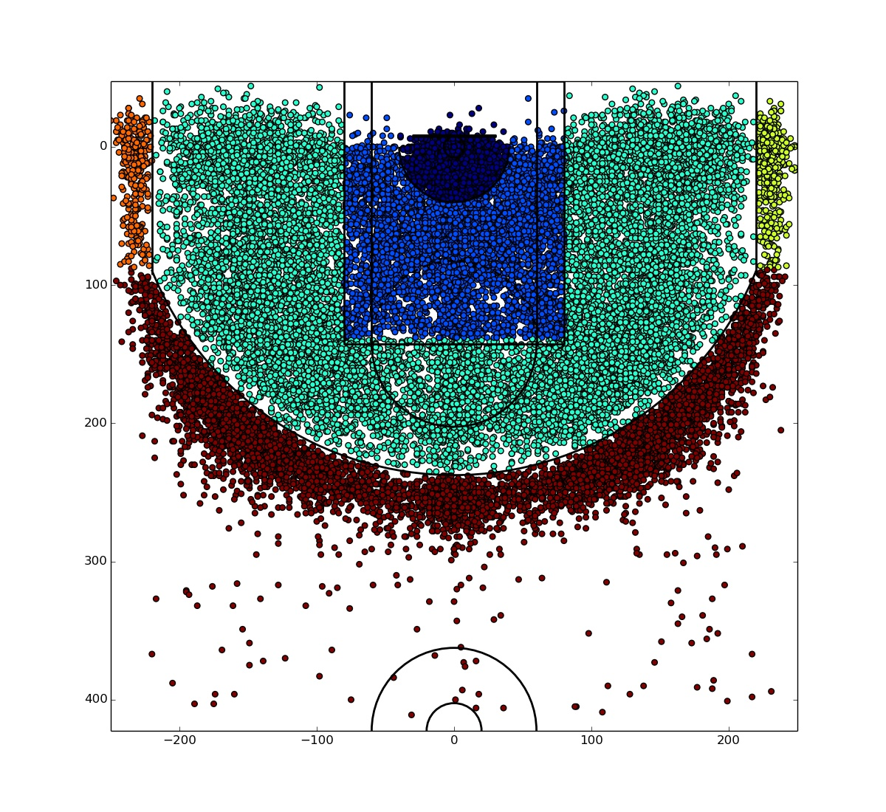
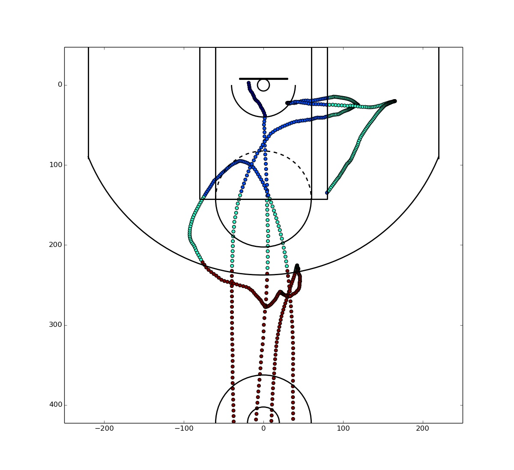

# movement-quadrants
Using a K-Nearest Neighbor Classifier, this repository will hold work to support encoding public SportVU movement data with quadrant locations (restricted area, left-corner three, etc.) of every frame.

This classifier has an extremely high accuracy and can be used to further zone analysis research and create more advanced datasets from the lean SportVU data. This potentially (with some additions like closest defender) can be applied to recreate detailed shot logs from SportVU data, etc.

### Conversion
- Using `convert_full_court_to_half_court.py` you can take regular movement data found [here](https://github.com/sealneaward/nba-movement-data) and convert it into a format that can be interpreted by the classifier so that shot zones can be assigned to the data, frame by frame.

- The original movement data that is collected and widely used today looks like this.

- The conversion process first takes in that movement data and flips the movement that occurs on the second half of the court.

- Next, using some range translation, the movement can be converted to the version present in shot logs

### Classification
- Using `knn.py` you can take in previous shot log data, like [Kobe Bryant's entire shot log](https://www.kaggle.com/c/kobe-bryant-shot-selection/data) and train a classifier to classify coordinates in the shot log movement format.

- This is the original labelled data set with all basic shot zones identified

- Using the movement that has been converted into the shot log format, the KNN classifier can correctly label the zones that a player is moving in.

### Acknowledgements
- A large part of the plotting was done using [Savvas Tjortjoglou' s](https://github.com/savvastj) tutorials found [here](http://savvastjortjoglou.com/)

### TODO
- Package this repository so that all it takes in are file names in the movement folders **no_label, converted, and label**
- Instead of leaving the converted positions, leave the old x,y positions from original data so that it can be converted back to original form, but with the zone labels
